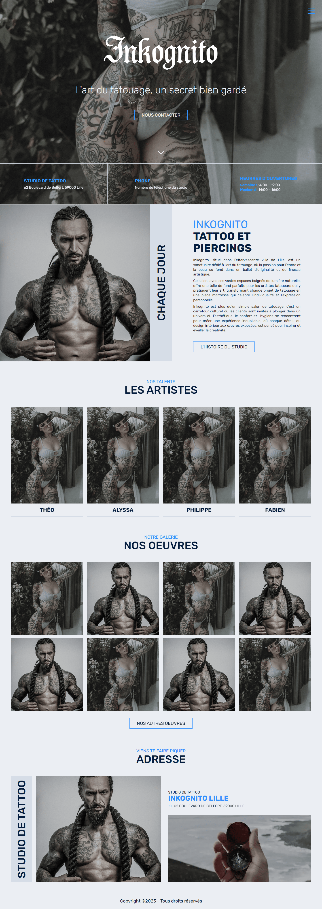

# ECV - Inkognito Theme Wordpress

| NVM Version | Update dependencies |
|:------------|:--------------------|
| `16`        | 9 November 2023     |



## Description

Welcome to the **Inkognito** Tattoo Studio **WordPress ACF Theme**, a sleek, modern, and fully responsive theme designed
specifically for tattoo studios, artists, and enthusiasts. Crafted with precision and a deep understanding of the tattoo
industry, this theme encapsulates the essence of artistry and creativity that defines the world of tattooing. Whether
you're showcasing your portfolio, booking appointments, or sharing your tattoo journey, Inkognito is the perfect digital
canvas to bring your studio's online presence to life.

## Requirements

- [NVM](https://github.com/nvm-sh/nvm)

## Installation

Go to theme directory:

```
cd wp-content/themes/ecv-inkognito/
```

Run the command:

```
npm i
```

## How to compile CSS assets?

Run the command:

```
npm run sass
```

## Auteur

- [**RICHIER Théo**](https://github.com/VidarDev)